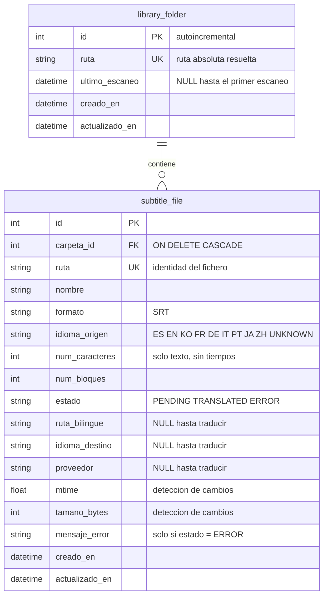

# Modelo de datos

Esquema de la base de datos SQLite de srt-bilingual. Refleja la migración
`4684c713e94f` (Fase 1). Si cambias un modelo en `backend/app/models/`, genera la
migración **y actualiza este documento en el mismo commit**.

> **Este fichero es la fuente de verdad.** Al lado hay una versión visual del mismo
> contenido, `modelo-datos.html`: es autocontenida (sin dependencias externas), así
> que se abre con doble clic desde el disco. Si tocas el esquema, actualiza las dos.
>
> El diagrama de aquí abajo es Mermaid: VS Code (vista previa de markdown) y GitHub
> lo dibujan solos, no hace falta nada más.

## Principio rector

> **El sistema de ficheros es la fuente de verdad; la base de datos es un índice
> reconstruible.**

Todo lo que hay en las tablas se puede regenerar borrando el `.db`, aplicando las
migraciones y lanzando un escaneo. Ninguna decisión del sistema depende de un dato
que solo exista en la base de datos: lo traducido se reconoce porque el
`.bilingue.srt` está en disco, no porque una fila lo diga.

## Diagrama



## `library_folder`

Espejo en base de datos de la variable `MEDIA_FOLDERS` del `.env`. Existe para dos
cosas: colgar de ella los subtítulos (y poder borrarlos en cascada al dejar de
vigilar una carpeta) y registrar cuándo se escaneó por última vez.

| Columna | Tipo SQLite | Nulo | Para qué sirve |
|---|---|---|---|
| `id` | `INTEGER` PK | no | Clave primaria |
| `ruta` | `VARCHAR` | no | Ruta absoluta ya resuelta con `Path.resolve()`. **Única** |
| `ultimo_escaneo` | `DATETIME` | sí | Momento del último escaneo; `NULL` si nunca se escaneó |
| `creado_en` | `DATETIME` | no | Alta de la fila |
| `actualizado_en` | `DATETIME` | no | Se refresca sola vía `onupdate` |

**Índices:** `ix_library_folder_ruta` (ÚNICO) sobre `ruta`.

Las carpetas no se dan de alta a mano: el escaneo las **reconcilia** contra
`MEDIA_FOLDERS`. Quitar una ruta del `.env` borra su fila en el siguiente escaneo.

## `subtitle_file`

El inventario propiamente dicho: un `.srt` **de origen** encontrado en disco.

Los ficheros `.bilingue.srt` **no tienen fila propia**: son un atributo del
original (`ruta_bilingue`). El escáner los excluye explícitamente como fuente para
no acabar traduciendo traducciones.

| Columna | Tipo SQLite | Nulo | Para qué sirve |
|---|---|---|---|
| `id` | `INTEGER` PK | no | Clave primaria |
| `carpeta_id` | `INTEGER` FK | no | Carpeta a la que pertenece. `ON DELETE CASCADE` |
| `ruta` | `VARCHAR` | no | Ruta absoluta. **Única**: es la identidad del fichero |
| `nombre` | `VARCHAR` | no | Nombre del fichero, para mostrarlo sin partir la ruta |
| `formato` | `VARCHAR(3)` | no | `SRT`. Reservado para VTT/ASS sin migrar el esquema |
| `idioma_origen` | `VARCHAR(7)` | no | Deducido del sufijo del nombre; `UNKNOWN` si no se reconoce |
| `num_caracteres` | `INTEGER` | no | Caracteres **de texto**, sin índices ni marcas de tiempo. Es la métrica que sostendrá el cálculo de cuota (Fase 4) |
| `num_bloques` | `INTEGER` | no | Número de subtítulos (cues) del fichero |
| `estado` | `VARCHAR(10)` | no | `PENDING` / `TRANSLATED` / `ERROR` |
| `ruta_bilingue` | `VARCHAR` | sí | Ruta del `.bilingue.srt` cuando existe |
| `idioma_destino` | `VARCHAR(7)` | sí | Idioma al que se tradujo |
| `proveedor` | `VARCHAR` | sí | Quién tradujo (DeepL…). Se rellena en Fase 3 |
| `mtime` | `FLOAT` | no | Fecha de modificación del fichero (epoch) |
| `tamano_bytes` | `INTEGER` | no | Tamaño del fichero |
| `mensaje_error` | `VARCHAR` | sí | Mensaje del parser cuando `estado = ERROR` |
| `creado_en` | `DATETIME` | no | Alta de la fila |
| `actualizado_en` | `DATETIME` | no | Se refresca sola vía `onupdate` |

**Índices:**

| Índice | Columna | Único | Por qué |
|---|---|---|---|
| `ix_subtitle_file_ruta` | `ruta` | sí | Identidad del fichero; el escaneo busca por ruta en cada pasada |
| `ix_subtitle_file_carpeta_id` | `carpeta_id` | no | Recorrer los subtítulos de una carpeta |
| `ix_subtitle_file_estado` | `estado` | no | El filtro `GET /subtitles?estado=` y el listado del frontend |

## Estados

```
                  parseo OK                   existe el .bilingue.srt
   (fichero) ──────────────────► PENDING ◄───────────────────────► TRANSLATED
       │                                    desaparece el bilingüe
       │ parseo falla
       └──────────────► ERROR  (mensaje_error con el motivo)
```

- `PENDING` — inventariado y contado, sin versión bilingüe en disco.
- `TRANSLATED` — existe el fichero `<base>.<ORIGEN>-<DESTINO>.bilingue.srt` junto
  al original.
- `ERROR` — el `.srt` está malformado o no se pudo leer. El escaneo continúa con
  los demás ficheros; el motivo queda en `mensaje_error`.

`estado` es **derivado, no autoritativo**: si borras el `.bilingue.srt`, el
siguiente escaneo devuelve la fila a `PENDING`. Un fichero en `ERROR` no se
comprueba contra el bilingüe hasta que vuelva a parsear bien.

## Decisiones de diseño (y sus costes)

**1. Los enums se guardan como texto, sin `CHECK` en la base de datos.**
SQLAlchemy mapea `Enum` a `VARCHAR(n)` y desde la 1.4 **no** genera la restricción
`CHECK` salvo que se pida (`create_constraint=True`). La validación vive en Python
(SQLAlchemy al asignar, Pydantic al serializar). Consecuencia práctica: un `UPDATE`
hecho a mano por SQL puede meter un valor imposible sin que la BD proteste.

**2. Detección de cambios por `mtime` + `tamano_bytes`, no por hash.**
Comparar dos números es mucho más barato que releer y hashear cada fichero en cada
escaneo. El coste: una edición que conserve exactamente fecha y tamaño pasaría
desapercibida. Para uso doméstico es un intercambio razonable; si algún día molesta,
el sitio donde tocarlo es `scanner._escanear_carpeta`.

**3. Las fechas se guardan como UTC *naive*.**
Las columnas se declaran `DateTime(timezone=True)` y se escriben con
`datetime.now(UTC)`, pero **SQLite no almacena zona horaria**: al leerlas vuelven
sin offset. Por eso la API devuelve `2026-07-30T19:16:14.850184` y no
`...+00:00`. Regla: todo lo que hay en la base de datos **es UTC**; convertir a
hora local es responsabilidad del frontend.

**4. La ruta es la identidad, no el par (carpeta, nombre).**
`ruta` es única globalmente, así que no hace falta un índice compuesto. Renombrar o
mover un fichero se ve como "desaparece uno y aparece otro": el viejo se borra por
huérfano y el nuevo se da de alta. Se pierde el histórico de esa fila, algo
irrelevante mientras la BD sea un índice reconstruible.

**5. Borrado duro de carpetas, no baja lógica.**
No hay columna `activa`. Quitar una carpeta del `.env` borra la fila y la cascada
se lleva sus subtítulos. Volver a añadirla los redescubre, incluido su estado
`TRANSLATED`, porque el bilingüe sigue en disco.

## Pendiente: `provider_usage` (Fase 4)

Tabla aún no creada. Registrará el consumo por proveedor y mes para elegir a quién
mandar cada traducción según la cuota libre:

| Columna | Idea |
|---|---|
| `proveedor` | `DEEPL`, … |
| `periodo` | año-mes (`2026-07`) |
| `caracteres_consumidos` | acumulado del mes |
| `cuota_mensual` | límite del plan |

Clave única prevista: (`proveedor`, `periodo`).

## Trabajar con las migraciones

```powershell
cd backend
uv run alembic upgrade head                              # aplicar
uv run alembic current                                   # revisión aplicada
uv run alembic revision --autogenerate -m "descripcion"  # generar tras tocar un modelo
uv run alembic downgrade -1                              # deshacer la última
```

Dos cosas a tener presentes:

- **Revisa siempre lo que genera `--autogenerate`.** Detecta tablas, columnas e
  índices, pero no adivina renombrados: un `ALTER` mal interpretado se traduce en
  borrar una columna y crear otra, perdiendo los datos.
- `alembic/env.py` toma la URL de `app.config.settings`, no de `alembic.ini`. La
  línea `sqlalchemy.url` del `.ini` sigue ahí pero es inerte.
