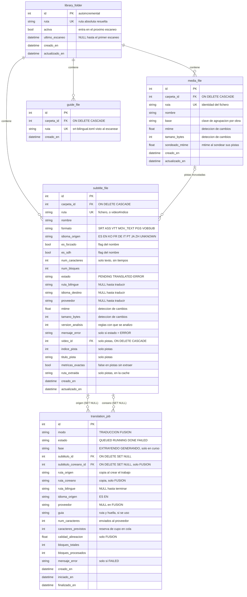

# Modelo de datos

Esquema de la base de datos SQLite de srt-bilingual. Refleja las migraciones
`4684c713e94f` (Fase 1), `bd028a52d162` (columna `activa`), `deb86f77e1a9`
(tabla `media_file`), `6f170d42eb87` (flags y `version_analisis`), `b9edc39727eb`
(tabla `translation_job`), `4447e8a4d4c5` (`caracteres_previstos`), `c3a9e5f17b20`
(pistas incrustadas), `e81d4b0c9a37` (`fase` de los trabajos) y `1dad6a0e64cd`
(tabla `guide_file` y `guia` de los trabajos). Si cambias un modelo en `backend/app/models/`, genera la
migración **y actualiza este documento en el mismo commit**.

> **Este fichero es la fuente de verdad.** Al lado hay una versión visual del mismo
> contenido, `modelo-datos.html`: es autocontenida (sin dependencias externas), así
> que se abre con doble clic desde el disco. Si tocas el esquema, actualiza las dos.
>
> El diagrama de aquí abajo es Mermaid: VS Code (vista previa de markdown) y GitHub
> lo dibujan solos, no hace falta nada más.

## Principio rector

> **El sistema de ficheros es la fuente de verdad; la base de datos es un índice
> reconstruible.**

Todo lo que hay en las tablas se puede regenerar borrando el `.db`, aplicando las
migraciones y lanzando un escaneo, **salvo `translation_job`**, que es historial de
trabajos y de cuota consumida (ver su sección). Las guías de traducción no están en
la base de datos: son ficheros de la biblioteca, y `guide_file` solo las indexa. Ninguna decisión del sistema depende de un dato
que solo exista en la base de datos: lo traducido se reconoce porque el
`.bilingue.srt` está en disco, no porque una fila lo diga.

## Diagrama


```mermaid
erDiagram
    library_folder ||--o{ subtitle_file : "contiene"
    library_folder ||--o{ media_file : "contiene"
    library_folder ||--o{ guide_file : "contiene"
    media_file |o--o{ subtitle_file : "pistas incrustadas"
    subtitle_file |o--o{ translation_job : "origen (SET NULL)"
    subtitle_file |o--o{ translation_job : "coreano (SET NULL)"

    translation_job {
        int      id                   PK
        string   modo                    "TRADUCCION FUSION"
        string   estado                  "QUEUED RUNNING DONE FAILED"
        string   fase                    "EXTRAYENDO GENERANDO, solo en curso"
        int      subtitulo_id         FK "ON DELETE SET NULL"
        int      subtitulo_coreano_id FK "ON DELETE SET NULL, solo FUSION"
        string   ruta_origen             "copia al crear el trabajo"
        string   ruta_coreano            "copia, solo FUSION"
        string   ruta_bilingue           "NULL hasta terminar"
        string   idioma_origen           "ES EN"
        string   proveedor               "NULL en FUSION"
        string   guia                    "ruta y huella, si se uso"
        int      num_caracteres          "enviados al proveedor"
        int      caracteres_previstos    "reserva de cupo en cola"
        float    calidad_alineacion      "solo FUSION"
        int      bloques_totales
        int      bloques_procesados
        string   mensaje_error           "solo si FAILED"
        datetime creado_en
        datetime iniciado_en
        datetime finalizado_en
    }

    media_file {
        int      id             PK
        int      carpeta_id     FK "ON DELETE CASCADE"
        string   ruta           UK "identidad del fichero"
        string   nombre
        string   base              "clave de agrupacion por obra"
        float    mtime             "deteccion de cambios"
        int      tamano_bytes      "deteccion de cambios"
        float    sondeado_mtime    "mtime al sondear sus pistas"
        datetime creado_en
        datetime actualizado_en
    }

    guide_file {
        int      id             PK
        int      carpeta_id     FK "ON DELETE CASCADE"
        string   ruta           UK "srt-bilingual.toml visto al escanear"
        datetime creado_en
    }

    library_folder {
        int      id             PK "autoincremental"
        string   ruta           UK "ruta absoluta resuelta"
        bool     activa            "entra en el proximo escaneo"
        datetime ultimo_escaneo    "NULL hasta el primer escaneo"
        datetime creado_en
        datetime actualizado_en
    }

    subtitle_file {
        int      id             PK
        int      carpeta_id     FK "ON DELETE CASCADE"
        string   ruta           UK "fichero, o video#indice"
        string   nombre
        string   formato           "SRT ASS VTT MOV_TEXT PGS VOBSUB"
        string   idioma_origen     "ES EN KO FR DE IT PT JA ZH UNKNOWN"
        bool     es_forzado        "flag del nombre"
        bool     es_sdh            "flag del nombre"
        int      num_caracteres    "solo texto, sin tiempos"
        int      num_bloques
        string   estado            "PENDING TRANSLATED ERROR"
        string   ruta_bilingue     "NULL hasta traducir"
        string   idioma_destino    "NULL hasta traducir"
        string   proveedor         "NULL hasta traducir"
        float    mtime             "deteccion de cambios"
        int      tamano_bytes      "deteccion de cambios"
        int      version_analisis  "reglas con que se analizo"
        string   mensaje_error     "solo si estado = ERROR"
        int      video_id       FK "solo pistas, ON DELETE CASCADE"
        int      indice_pista      "solo pistas"
        string   titulo_pista      "solo pistas"
        bool     metricas_exactas  "false en pistas sin extraer"
        string   ruta_extraida     "solo pistas, en la cache"
        datetime creado_en
        datetime actualizado_en
    }
```

## `library_folder`

Catálogo de las carpetas que se vigilan. Existe para tres cosas: colgar de ella los
subtítulos (y poder borrarlos en cascada al dejar de vigilar la carpeta), recordar
si entra en el escaneo y registrar cuándo se escaneó por última vez.

| Columna | Tipo SQLite | Nulo | Para qué sirve |
|---|---|---|---|
| `id` | `INTEGER` PK | no | Clave primaria |
| `ruta` | `VARCHAR` | no | Ruta absoluta ya resuelta con `Path.resolve()`. **Única** |
| `activa` | `BOOLEAN` | no | Si entra en el próximo escaneo. Desmarcarla no borra nada: sus subtítulos siguen inventariados y visibles |
| `ultimo_escaneo` | `DATETIME` | sí | Momento del último escaneo; `NULL` si nunca se escaneó |
| `creado_en` | `DATETIME` | no | Alta de la fila |
| `actualizado_en` | `DATETIME` | no | Se refresca sola vía `onupdate` |

**Índices:** `ix_library_folder_ruta` (ÚNICO) sobre `ruta`.

Las carpetas se dan de alta y de baja desde la interfaz, vía `/folders`; el escaneo
ya no las crea ni las borra, solo recorre las que se le indican. **Dos carpetas no
pueden solaparse**: `POST /folders` rechaza con `409` una ruta que sea ancestro o
descendiente de otra ya registrada, porque el escaneo es recursivo y el mismo `.srt`
acabaría reclamado por las dos, chocando contra el índice único de `subtitle_file.ruta`.

## `subtitle_file`

El inventario propiamente dicho: un subtítulo **de origen**. Puede ser un `.srt`
encontrado en disco o, desde la Fase 5, una **pista incrustada** en un vídeo
(`video_id` no nulo). Van en la misma tabla a propósito: la selección de origen y
coreano, los trabajos y la interfaz las tratan igual, y una obra puede mezclar una
pista con un `.srt` de al lado. Solo se guardan las pistas ES/EN/KO o sin idioma
declarado; las de imagen (PGS/VobSub) también, para que la interfaz explique por qué
no sirven.

Los ficheros `.bilingue.srt` **no tienen fila propia**: son un atributo del
original (`ruta_bilingue`). El escáner los excluye explícitamente como fuente para
no acabar traduciendo traducciones.

| Columna | Tipo SQLite | Nulo | Para qué sirve |
|---|---|---|---|
| `id` | `INTEGER` PK | no | Clave primaria |
| `carpeta_id` | `INTEGER` FK | no | Carpeta a la que pertenece. `ON DELETE CASCADE` |
| `ruta` | `VARCHAR` | no | Ruta absoluta. **Única**: es la identidad del fichero. En una pista, `<ruta del vídeo>#<índice>`, que no es un fichero |
| `nombre` | `VARCHAR` | no | Nombre del fichero, para mostrarlo sin partir la ruta. En una pista, `Pista 7 · NF_Spanish` |
| `formato` | `VARCHAR(8)` | no | `SRT` en los ficheros; en las pistas, su códec: `ASS`, `VTT`, `MOV_TEXT`, `SRT`, o de imagen `PGS`/`VOBSUB` |
| `idioma_origen` | `VARCHAR(7)` | no | Idioma del subtítulo. Manda el **contenido** cuando da un veredicto claro (hangul para `KO`, densidad de palabras frecuentes para `ES`/`EN`); si no, el sufijo del nombre. `UNKNOWN` si ninguno lo aclara |
| `es_forzado` | `BOOLEAN` | no | El nombre lo declara forzado (`.forced`, `(Forced)`): solo carteles, no sirve como origen |
| `es_sdh` | `BOOLEAN` | no | El nombre lo declara SDH/CC/HI: trae descripciones sonoras; origen solo si no hay otro |
| `num_caracteres` | `INTEGER` | no | Caracteres **de texto**, sin índices ni marcas de tiempo. Es la métrica que sostendrá el cálculo de cuota (Fase 4) |
| `num_bloques` | `INTEGER` | no | Número de subtítulos (cues) del fichero |
| `estado` | `VARCHAR(10)` | no | `PENDING` / `TRANSLATED` / `ERROR` |
| `ruta_bilingue` | `VARCHAR` | sí | Ruta del `.bilingue.srt` cuando existe |
| `idioma_destino` | `VARCHAR(7)` | sí | Idioma al que se tradujo |
| `proveedor` | `VARCHAR` | sí | Quién tradujo (DeepL…). Se rellena en Fase 3 |
| `mtime` | `FLOAT` | no | Fecha de modificación del fichero (epoch) |
| `tamano_bytes` | `INTEGER` | no | Tamaño del fichero |
| `version_analisis` | `INTEGER` | no | Versión de las reglas de análisis (`scanner.VERSION_ANALISIS`) con que se procesó. Si el código las mejora, el siguiente escaneo reprocesa la fila aunque el fichero no haya cambiado |
| `mensaje_error` | `VARCHAR` | sí | Mensaje del parser cuando `estado = ERROR` |
| `video_id` | `INTEGER` FK | sí | Solo en pistas: el vídeo que la contiene. `ON DELETE CASCADE`: la pista se va con su vídeo |
| `indice_pista` | `INTEGER` | sí | Solo en pistas: índice del stream en el contenedor (`0:7` para ffmpeg). Identifica la pista al volver a sondear el vídeo |
| `titulo_pista` | `VARCHAR` | sí | Solo en pistas: el título que trae (`NF_Spanish`, `Latin American (Forced)`). De ahí salen los flags de forzado y SDH, y la variante latina |
| `metricas_exactas` | `BOOLEAN` | no | `true` en los `.srt`. En una pista sin extraer, `false`: `num_bloques` sale de las estadísticas de su cabecera (o es `0` = no se sabe) y `num_caracteres` es una cota superior (los bytes de la pista) |
| `ruta_extraida` | `VARCHAR` | sí | Solo en pistas: dónde está extraída, en la caché. `NULL` hasta extraerla (Fase 5, hito 2) |
| `creado_en` | `DATETIME` | no | Alta de la fila |
| `actualizado_en` | `DATETIME` | no | Se refresca sola vía `onupdate` |

En una pista, `mtime` y `tamano_bytes` son los de su vídeo, y `es_forzado`/`es_sdh`
salen de su título y no del nombre de un fichero.

**Índices:**

| Índice | Columna | Único | Por qué |
|---|---|---|---|
| `ix_subtitle_file_ruta` | `ruta` | sí | Identidad del fichero; el escaneo busca por ruta en cada pasada |
| `ix_subtitle_file_carpeta_id` | `carpeta_id` | no | Recorrer los subtítulos de una carpeta |
| `ix_subtitle_file_estado` | `estado` | no | El filtro `GET /subtitles?estado=` y el listado del frontend |
| `ix_subtitle_file_video_id` | `video_id` | no | Las pistas de un vídeo |

## `media_file`

Los contenedores de vídeo (`.mkv`, `.mp4`, `.avi`, `.m4v`, `.mov`). El escaneo solo
registra que están ahí, para poder dibujar la biblioteca aunque no haya ningún `.srt`
al lado. Después, en segundo plano, se **sondea su cabecera** con `ffprobe` y sus
pistas de subtítulo pasan a `subtitle_file` (Fase 5).

| Columna | Tipo SQLite | Nulo | Para qué sirve |
|---|---|---|---|
| `id` | `INTEGER` PK | no | Clave primaria |
| `carpeta_id` | `INTEGER` FK | no | Carpeta a la que pertenece. `ON DELETE CASCADE` |
| `ruta` | `VARCHAR` | no | Ruta absoluta. **Única**: es la identidad del fichero |
| `nombre` | `VARCHAR` | no | Nombre del fichero |
| `base` | `VARCHAR` | no | Nombre sin extensión ni sufijo de idioma. Es la clave por la que el árbol empareja el vídeo con sus subtítulos hermanos; se guarda calculada para no repetirlo en cada consulta |
| `mtime` | `FLOAT` | no | Fecha de modificación (epoch) |
| `tamano_bytes` | `INTEGER` | no | Tamaño del fichero |
| `sondeado_mtime` | `FLOAT` | sí | El `mtime` con que se sondearon sus pistas. Si no coincide con `mtime` (o es `NULL`), está pendiente de sondeo; así un vídeo sin cambios no se vuelve a abrir por la red |
| `creado_en` | `DATETIME` | no | Alta de la fila |
| `actualizado_en` | `DATETIME` | no | Se refresca sola vía `onupdate` |

**Índices:** `ix_media_file_ruta` (ÚNICO), `ix_media_file_carpeta_id`,
`ix_media_file_base`.

## `guide_file`

Dónde hay una **guía de traducción** (`srt-bilingual.toml`: glosario e instrucciones
de una serie), según el último escaneo. Es solo un índice: el contenido de la guía se
lee siempre del disco al usarla, así que editarla no requiere escanear. Existe para
que el árbol sepa qué obras tienen guía sin buscarla por la red, que en la biblioteca
real costaba 2,3 s por carga (348 carpetas). Ver `docs/plans/plan-glosario-por-obra.md`.

| Columna | Tipo SQLite | Nulo | Para qué sirve |
|---|---|---|---|
| `id` | `INTEGER` PK | no | Clave primaria |
| `carpeta_id` | `INTEGER` FK | no | Carpeta de biblioteca en la que está. `ON DELETE CASCADE` |
| `ruta` | `VARCHAR` | no | Ruta absoluta del fichero. **Única** |
| `creado_en` | `DATETIME` | no | Alta de la fila |

**Índices:** `ix_guide_file_ruta` (ÚNICO), `ix_guide_file_carpeta_id`.

## `translation_job`

Cada generación de un bilingüe (Fase 3): **por traducción**, que gasta cuota del
proveedor, o **por fusión** con un subtítulo coreano que ya existía, que no la gasta.
Se ejecuta en segundo plano y el frontend consulta aquí su progreso.

Es la única tabla que **no es un índice reconstruible**: es historial. Los
`num_caracteres` de los trabajos terminados son lo que la Fase 4 agregará por
proveedor y mes. Por eso sobrevive a sus subtítulos: si un escaneo borra el `.srt` de
origen, la clave foránea pasa a `NULL` (`ON DELETE SET NULL`) pero el trabajo, sus
rutas y sus caracteres se conservan.

| Columna | Tipo SQLite | Nulo | Para qué sirve |
|---|---|---|---|
| `id` | `INTEGER` PK | no | Clave primaria |
| `modo` | `VARCHAR(10)` | no | `TRADUCCION` / `FUSION` |
| `estado` | `VARCHAR(7)` | no | `QUEUED` / `RUNNING` / `DONE` / `FAILED` |
| `fase` | `VARCHAR(10)` | sí | Solo en `RUNNING`: `EXTRAYENDO` (sacando del vídeo las pistas que usa, sin progreso de bloques) o `GENERANDO`. Nula en cola y al terminar |
| `subtitulo_id` | `INTEGER` FK | sí | Subtítulo de origen (ES/EN). `ON DELETE SET NULL` |
| `subtitulo_coreano_id` | `INTEGER` FK | sí | Solo en `FUSION`: el coreano que se alinea. `ON DELETE SET NULL` |
| `ruta_origen` | `VARCHAR` | no | Copia de la ruta del origen al crear el trabajo, para el historial. Si el origen es una pista incrustada, `<vídeo>#<índice>` |
| `ruta_coreano` | `VARCHAR` | sí | Ídem para el coreano, solo en `FUSION` |
| `ruta_bilingue` | `VARCHAR` | sí | Fichero generado; `NULL` hasta que termina |
| `idioma_origen` | `VARCHAR(7)` | no | `ES` o `EN`. El destino es siempre coreano |
| `proveedor` | `VARCHAR` | sí | Quién tradujo (DeepL…); `NULL` en `FUSION` |
| `guia` | `VARCHAR` | sí | La guía de traducción con que se tradujo, como `<ruta> (<huella>)`, si el proveedor la aprovechó. Historial: la guía puede cambiar después, y la huella dice qué versión se usó |
| `num_caracteres` | `INTEGER` | no | Caracteres enviados al proveedor; `0` en `FUSION`. Es el registro de consumo de la Fase 4: el de un proveedor en un mes es la suma de los de sus trabajos (cuentan también los fallidos: el proveedor ya los cobró) |
| `caracteres_previstos` | `INTEGER` | no | Lo que se espera enviar, fijado al crear el trabajo. Mientras está en cola o en curso, `caracteres_previstos − num_caracteres` queda **reservado** del cupo de su proveedor. Con una pista sin extraer es una cota (o 40.000 si no trae estadísticas) y se corrige a la cifra exacta al extraerla |
| `calidad_alineacion` | `FLOAT` | sí | Solo en `FUSION`: fracción de bloques coreanos bien colocados (0 a 1) |
| `bloques_totales` | `INTEGER` | no | Para la barra de progreso |
| `bloques_procesados` | `INTEGER` | no | Para la barra de progreso |
| `mensaje_error` | `VARCHAR` | sí | Motivo cuando `estado = FAILED` |
| `creado_en` | `DATETIME` | no | Alta del trabajo |
| `iniciado_en` | `DATETIME` | sí | Cuando la tarea de fondo lo recoge |
| `finalizado_en` | `DATETIME` | sí | Cuando termina, bien o mal |

**Índices:** `ix_translation_job_estado` (listar los trabajos activos, que el frontend
sondea) e `ix_translation_job_subtitulo_id` (historial de un subtítulo).

## Estados

```
                  parseo OK                   existe el .bilingue.srt
   (fichero) ──────────────────► PENDING ◄───────────────────────► TRANSLATED
       │                                    desaparece el bilingüe
       │ parseo falla
       └──────────────► ERROR  (mensaje_error con el motivo)
```

- `PENDING` — inventariado y contado, sin versión bilingüe en disco.
- `TRANSLATED` — existe el fichero `<base>.<ORIGEN>-<DESTINO>.bilingue.srt` junto
  al original.
- `ERROR` — el `.srt` está malformado o no se pudo leer. El escaneo continúa con
  los demás ficheros; el motivo queda en `mensaje_error`.

`estado` es **derivado, no autoritativo**: si borras el `.bilingue.srt`, el
siguiente escaneo devuelve la fila a `PENDING`. Un fichero en `ERROR` no se
comprueba contra el bilingüe hasta que vuelva a parsear bien.

## Decisiones de diseño (y sus costes)

**1. Los enums se guardan como texto, sin `CHECK` en la base de datos.**
SQLAlchemy mapea `Enum` a `VARCHAR(n)` y desde la 1.4 **no** genera la restricción
`CHECK` salvo que se pida (`create_constraint=True`). La validación vive en Python
(SQLAlchemy al asignar, Pydantic al serializar). Consecuencia práctica: un `UPDATE`
hecho a mano por SQL puede meter un valor imposible sin que la BD proteste.

**2. Detección de cambios por `mtime` + `tamano_bytes`, no por hash.**
Comparar dos números es mucho más barato que releer y hashear cada fichero en cada
escaneo. El coste: una edición que conserve exactamente fecha y tamaño pasaría
desapercibida. Para uso doméstico es un intercambio razonable; si algún día molesta,
el sitio donde tocarlo es `scanner._escanear_carpeta`.

**3. Las fechas se guardan como UTC *naive*.**
Las columnas se declaran `DateTime(timezone=True)` y se escriben con
`datetime.now(UTC)`, pero **SQLite no almacena zona horaria**: al leerlas vuelven
sin offset. Por eso la API devuelve `2026-07-30T19:16:14.850184` y no
`...+00:00`. Regla: todo lo que hay en la base de datos **es UTC**; convertir a
hora local es responsabilidad del frontend.

**4. La ruta es la identidad, no el par (carpeta, nombre).**
`ruta` es única globalmente, así que no hace falta un índice compuesto. Renombrar o
mover un fichero se ve como "desaparece uno y aparece otro": el viejo se borra por
huérfano y el nuevo se da de alta. Se pierde el histórico de esa fila, algo
irrelevante mientras la BD sea un índice reconstruible.

**5. Borrar una carpeta es borrar; desmarcarla, no.**
Son dos operaciones distintas y conviene no confundirlas:

- `DELETE /folders/{id}` borra la fila y la cascada se lleva sus subtítulos. No hay
  baja lógica de datos. Volver a añadirla los redescubre, incluido su estado
  `TRANSLATED`, porque el bilingüe sigue en disco.
- `activa = false` solo la excluye del próximo escaneo. Sus subtítulos siguen en la
  base de datos y en el árbol, con el estado del último escaneo. El coste: si tocas
  esos ficheros por detrás, lo que ves se queda desfasado hasta que la vuelvas a
  marcar y escanees.

**6. El árbol de la biblioteca no se almacena.**
No hay columna `padre_id` ni tabla de jerarquía. La estructura que muestra el
frontend se **deriva** de las rutas de `media_file` y `subtitle_file`, partiéndolas
por segmentos relativos a la carpeta que las contiene (`services/library_tree.py`).
Sale gratis en esquema, llega a cualquier profundidad y se autocorrige cuando
renombras carpetas en disco. La hoja del árbol es la **obra** (capítulo o película),
no el fichero: el vídeo y los `.srt` que comparten `base_sin_idioma` se agrupan en
una sola.

El coste de agrupar por nombre: si el `.srt` no se llama como el vídeo, aparecerán
como dos obras distintas. Es el mismo criterio que usa `derivar_nombre_bilingue`,
así que la convención es coherente en todo el sistema.

**7. El escaneo no abre los vídeos; el sondeo, solo su cabecera.**
El escaneo registra la existencia de cada contenedor y su huella (`mtime`+tamaño),
nada más: 215 MKV sobre un recurso de red tardan ~2 s. Las pistas las lee después
un sondeo en segundo plano con `ffprobe`, que lee solo la cabecera (0,3–0,8 s por
fichero; ~6 min la primera pasada por Anime) y solo de los vídeos nuevos o cambiados
(`sondeado_mtime`). Extraer el texto de una pista, en cambio, obliga a leer el MKV
entero, así que no se hace en el escaneo (Fase 5, hito 2).

**8. Una pista incrustada es una fila de `subtitle_file`, no de una tabla propia.**
Con tabla propia habría que duplicar la selección de origen, los candidatos, los
trabajos y sus claves foráneas, y el frontend. El coste: unas cuantas columnas que
solo tienen sentido en pistas, y que `ruta` deja de ser siempre un fichero (en una
pista es `<vídeo>#<índice>`); el código que lee un subtítulo del disco debe mirar
`es_pista` antes.

**9. La guía de traducción vive en disco; la base de datos solo sabe dónde está.**
La escribe el usuario y no se puede reconstruir, así que por el principio rector no
puede vivir en una tabla: es un fichero dentro de la biblioteca, que viaja con ella
(y con el volumen de Docker). `guide_file` solo indexa su ubicación para el árbol. El
coste: una guía nueva no aparece en el árbol hasta el siguiente escaneo, como un
`.srt` nuevo; editar una existente, en cambio, vale al momento.

## Descartada: `provider_usage`

El plan original preveía una tabla `provider_usage` (proveedor, año-mes, caracteres
consumidos, cuota) para la Fase 4. **Se descartó al planificar esa fase**: el consumo
de un proveedor en un mes ya es la suma de `num_caracteres` de sus trabajos en
`translation_job`, y una segunda tabla con la misma cifra podría descuadrarse. Los
límites de los proveedores que no los informan por API (Azure) van en el `.env`. Ver
`docs/plans/plan-fase4.md`.

## Trabajar con las migraciones

```powershell
cd backend
uv run alembic upgrade head                              # aplicar
uv run alembic current                                   # revisión aplicada
uv run alembic revision --autogenerate -m "descripcion"  # generar tras tocar un modelo
uv run alembic downgrade -1                              # deshacer la última
```

Dos cosas a tener presentes:

- **Revisa siempre lo que genera `--autogenerate`.** Detecta tablas, columnas e
  índices, pero no adivina renombrados: un `ALTER` mal interpretado se traduce en
  borrar una columna y crear otra, perdiendo los datos.
- `alembic/env.py` toma la URL de `app.config.settings`, no de `alembic.ini`. La
  línea `sqlalchemy.url` del `.ini` sigue ahí pero es inerte.
